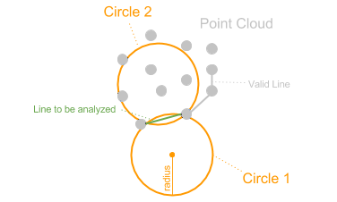

# PointCloudCrust

C++ implementation of [PointCloudCrust Library](https://github.com/meiXXI/PointCloudCrust)

---

The PointCloudCrust is an implementation of the PointCloudCrust Algorithm (or in-officially called "The Cheese-Maker")
which builds a crust around a point cloud (triangulation of a point cloud). The input of the algorithm is a list of
points located in a three-dimensional space plus the radius of a ball and the output is a set of triangles which defines
the "crust". The Algorithm does not only create the outer crust but also visualize innersided holes, structures and even
breakthroughs (like a cheese).

## The Point Cloud Crust Algorithm ("The Cheese-Maker")

The Point Cloud Crust Algorithm iterates over all triangles possible in the point cloud and decides whether to keep or not.
Each triangle is being analyzed individually and independently. So, the algorithm can be executed highly scalable.
The construction of the crust is basically just trigonometry.

### Explanation

Here the 2-dimensional explanation of the Point Cloud Algorithm. In a two dimensional world,
triangles can be substituted by lines and balls by circles:



Fist of all, a radius has to be defined. The radius defines the level of granularity being visualized in the final model.
When starting, the algorithm iterates over all available lines in the 2D point cloud. Each line is analyzed individually.
In order to find out the "surface-lines", two circles with the initially defined radius are being calculated.
Both circles passes the two points of the line. If one of the both circles has no other points inside, the line is
a "surface-line" and is being cached for the output. Lines which have points in both circles are being skipped.

### Performance

Here are some performance measurements:

| Description                 | Time, ms |
|-----------------------------|----------|
| 1 thread, Debug             | 10691    |
| 4 threads, Debug            | 3342     |
| 8 threads, Debug            | 1818     |
| 16 threads, Debug           | 1113     |
| **8 threads, -O3**          | **148**  |
| **Original Implementation** | **≈900** |

## Usage

You can find an example in [example](example) directory.

After library's `CMakeLists.txt` inclusion you can use it in 2 ways:

1. Include its files directly to your project:
   ```cmake
   add_executable(pcc_test main.cpp ${PointCloudCrust_SOURCES})
   ```
2. Link it as library:
   ```cmake
   set(PCC_BUILD_SHARED ON) # or set(PCC_BUILD_STATIC ON)
   # ...
   target_link_libraries(pcc_test pcc)
   ```

## CMake Options

| Option                 | Default | Description                                                         |
|------------------------|---------|---------------------------------------------------------------------|
| `PCC_BUILD_SHARED`     | OFF     | Build shared library `pcc`                                          |
| `PCC_BUILD_STATIC`     | OFF     | Build static library `pcc`                                          |
| `PCC_DEBUG`            | OFF     | If disabled, library will be built with `-O3` (`/O2`) optimizations |
| `PCC_DOUBLE_PRECISION` | OFF     | Use `double` instead of `float`                                     |
